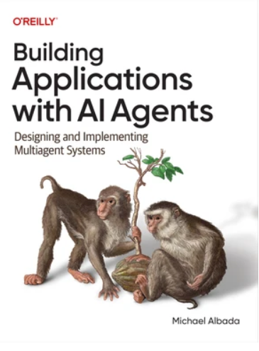

# AI Practice

Ongoing hands-on practice with agentic AI, LLM application development, and classic machine learning. Each top-level folder is a self-contained playground tied to a course, book, or personal experiment — code, notes, and small apps built while learning the concepts.

## Overview

- **[building-applications-with-ai-agent/](building-applications-with-ai-agent/)** — exercises following *Building Applications with AI Agents* (Michael Albada), progressing chapter by chapter through agent design fundamentals and tool use.
  
- **[copilot/](copilot/)** — an Express.js + React shopping-cart app used to practice building with an AI coding copilot.
- **[langchain-1/](langchain-1/)** — early LangChain practice scripts.
- **[llm/](llm/)** — assorted LLM experiments across providers (OpenAI, Gemini): agentic tool use, RAG, a weather app, and a simple chat client/server.
- **[ml/](ml/)** — classical machine learning exercises (regression, classification, decision trees, neural networks) from the O'Reilly "Machine Learning from Scratch" training.

## Folder Structure

```
ai-practice/
├── assets/
│   └── Building-Applications-With-AI-Agents.png
├── building-applications-with-ai-agent/
│   ├── chapter-2/
│   ├── chapter-3/
│   ├── chapter-4-tool-use/
│   ├── pyproject.toml
│   └── uv.lock
├── claude-code-multi-model/ # multi-model AI help desk assistant from the "Claude Code: Designing Multi-Model AI Systems" LinkedIn Learning course
├── copilot/
│   ├── client/              # React frontend
│   ├── middleware/
│   ├── routes/
│   └── server.js
├── langchain-1/
│   ├── main.py
│   ├── pyproject.toml
│   └── uv.lock
├── llm/
│   ├── agentic/
│   ├── chat_app/
│   ├── copilot-interactions/
│   ├── docker/
│   ├── gemini/
│   ├── openai/
│   └── weather_app/
├── ml/
│   ├── code/
│   │   ├── homework_answers/
│   │   ├── section_ii/      # regression
│   │   ├── section_iii/     # logistic regression
│   │   ├── section_iv/      # naive bayes
│   │   ├── section_v/       # decision trees & random forests
│   │   └── section_vi/      # neural networks
│   ├── exercises/
│   └── oreilly_machine_learning_from_scratch.pptx
├── .gitignore
└── README.md
```
</content>
